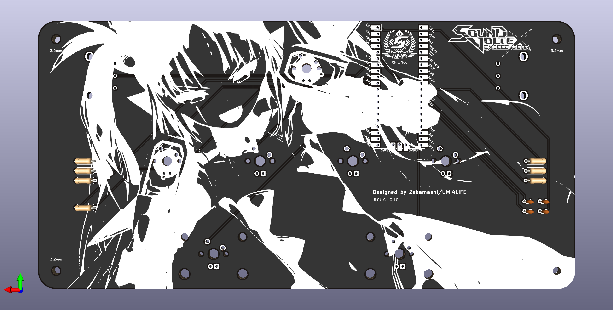

# Mini-Voltex

## PCB Pinouts
| Button | Switch Pin | LED Pin |
|--------|------------|---------|
| VOL-L  | 0,1        | -       |
| VOL-R  | 2,3        | -       | 
| BT-A   | 26         | 27      |
| BT-B   | 22         | 28      |
| BT-C   | 8          | 9       |
| BT-D   | 6          | 7       |
| FX-L   | 20         | 21      |
| FX-R   | 10         | 11      |
| START  | 4          | 5       |

prebuilt https://github.com/speedypotato/Pico-Game-Controller firmware file with the following pinouts can be found in Others/Pico_Game_Controller.uf2

## Parts Required
| Part                                              | Qty | Where to get                                                                                                                 |
|---------------------------------------------------|-----|------------------------------------------------------------------------------------------------------------------------------|
| PCB                                               | 1   | PCB/gerber.zip, order from JLCPCB                                                                                            |
| Plate acrylic cut (1.5mm)                         | 1   | Case/plate.dxf-ai, order from any laser cutting service                                                                      |
| Spacer acrylic cut (3mm)                          | 1   | Case/spacer.dxf-ai, order from any laser cutting service                                                                     |
| 3D printed case                                   | 1   | Case/Case.stl, can be ordered from JLCPCB (but recommend printing with your own printer to keep cost down)                   |
| 3D printed keycaps set (preferably resin printed) | 1   | Others/sdvx keycaps set.stl, ordered from JLCPCB                                                                             |
| Raspberry pi pico                                 | 1   | Literally anywhere, USB-C clones also works                                                                                  |
| PEC16-4015F-N0024-ND                              | 2   | https://www.digikey.co.th/en/products/detail/bourns-inc/PEC16-4015F-N0024/3780221                                            | 
| O-rings for encoders  (ID: 8mm)                   | 2   | https://shp.ee/t63umuk                                                                                                       |
| Aluminium knobs                                   | 2   | https://a.aliexpress.com/_mNUR4yI                                                                                            |
| 2U cherry stabilizers                             | 2   | https://www.digikey.co.th/en/products/detail/cherry-americas-llc/0G990224/424648 (PCB mounted stabs of any brand also works) |
| Mechanical switches                               | 7   | I used Gateron pro silver and Akko silver on mine                                                                            |
| LED for switches                                  | 7   | https://shp.ee/kx9bmj4 (2x3x4)                                                                                               |
| 100Ω 1/4W resistor                                | 7   | https://shp.ee/hze8gv4                                                                                                       |
| 10nF 50V capacitor                                | 4   | https://shp.ee/rhgtur4                                                                                                       |
| M3x15 flat round head screws                      | 4   | https://shp.ee/g4dy4ak                                                                                                       |
| Rubber pads                                       | 4+  | https://www.homepro.co.th/p/1176376                                                                                          |

